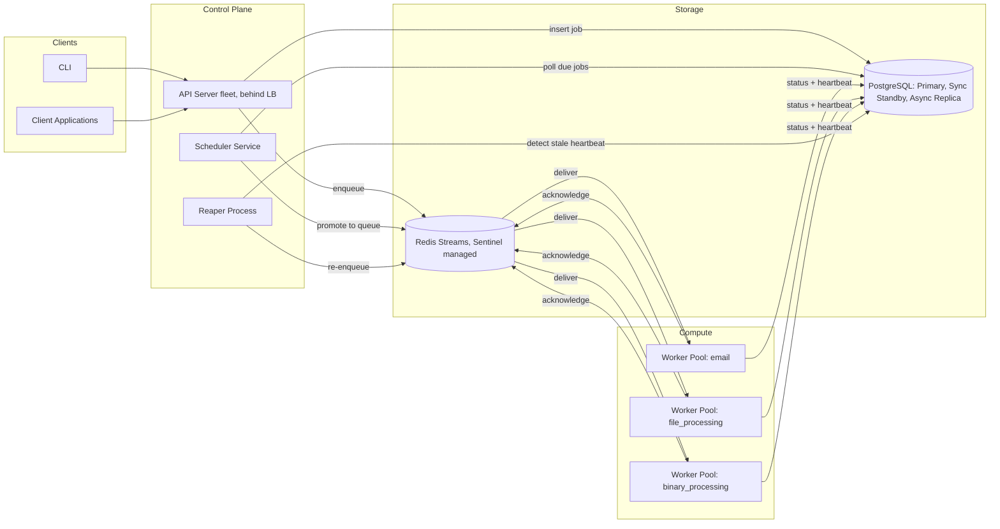
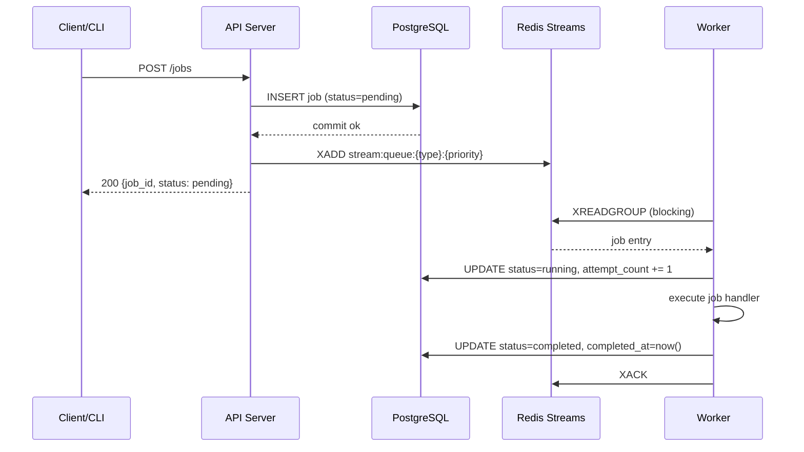
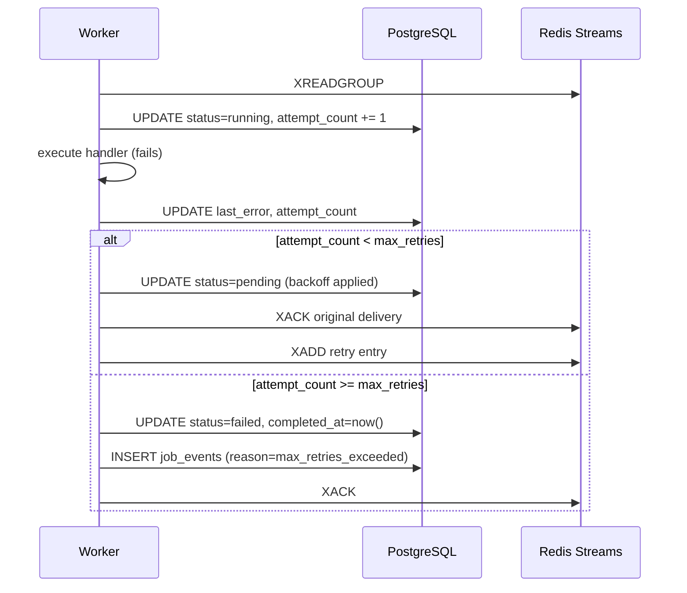
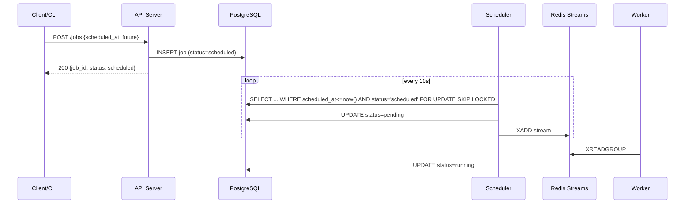
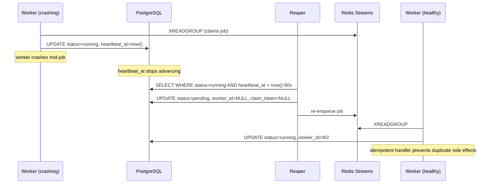

> **Editor's notes on this pass**
> This document reorganizes and copy-edits an internal system design paper into a repo-ready `ARCHITECTURE.md`. A few things worth flagging for reviewers:
> - The original diagrams in §6 were embedded images that aren't available in source form; they've been redrawn as Mermaid diagrams from the accompanying flow descriptions and should be checked against the originals.
> - The source used two different vocabularies for job state (`started/finished` in §7.4 vs. `running/completed` in §9 and §11.2). This document standardizes on `scheduled → pending → running → completed | failed`, with `cancelled` as an additional terminal state, matching the API examples and the DDL.
> - §14 (Security Considerations) ends mid-paragraph in the source. Only the threat-model summary that was provided is included below.
> - Typos, inconsistent number formatting (e.g. `4.300` → `4,300`), and grammar have been corrected throughout without changing technical intent.

---

## Table of Contents

1. Overview
2. Goals and Non-Goals
3. Assumptions and Constraints
4. Functional Requirements
5. Non-Functional Requirements
6. High-Level Architecture
7. Component Design
8. Capacity Estimates
9. Client API Contract
10. Database and Storage Requirements
11. Database Design
12. Failure Handling
13. Trade-offs and Alternatives
14. Security Considerations

---

## 1. Overview

OpenCode's task queue is a scalable, reliable distributed system for managing background jobs — email sends, file processing, binary processing, and similar asynchronous work. The primary design goal is high throughput under load together with low end-to-end latency for job execution.

---

## 2. Goals and Non-Goals

### 2.1 Goals

- Reliably produce binaries, email sends, file-processing operations, and other background work.
- Ensure every task/job runs **at least once**.
- Support high-scale job creation and processing without impacting the submitting user.
- Provide visibility into job status and failures.
- Support job scheduling and rescheduling.
- Support retrying failed jobs/tasks.

### 2.2 Non-Goals

- Building a workflow/orchestration engine (DAGs, multi-step pipelines).
- Managing streaming data.
- Real-time processing of jobs.

---

## 3. Assumptions and Constraints

### 3.1 Assumptions

- 17,280,000 monthly active users (MAU).
- 50% of users are active daily → 8,640,000 DAU.
- Users create 50 tasks/jobs per day on average.
- Workers have reliable network connectivity to Redis and PostgreSQL.
- Job handlers are idempotent.

### 3.2 Constraints

- Jobs are removed from the queue only after they have completed **and** been acknowledged by the worker.
- Maximum job payload size: 15 KB.
- Maximum job execution time: 5 minutes.
- Maximum concurrent jobs per worker: 35.
- Maximum job retention period: 4 days.

---

## 4. Functional Requirements

1. Execute asynchronous background jobs submitted by internal services.
2. Jobs can be scheduled for future execution.
3. Job status must be visible to callers.
4. Jobs can be created via the client application or the CLI.

---

## 5. Non-Functional Requirements

| Property | Requirement |
|---|---|
| **Reliability** | Jobs run at least once. |
| **Scalability** | Multiple workers per consumer group, and multiple consumer groups per stream. |
| **Availability** | The system absorbs large traffic bursts without falling over. |
| **Observability** | Status, logs, and alerts are available for job execution. |
| **Security** | User data and credentials are handled securely end to end. |

---

## 6. High-Level Architecture

### 6.1 Components

- **Producer/Client** — submits jobs and queries status.
- **Message Broker** (Redis Streams) — durable-enough transient delivery buffer.
- **Worker Pools** — consume and execute jobs.
- **Metadata Store** (PostgreSQL) — source of truth for job state.
- **Scheduler** — promotes delayed/scheduled jobs when they come due.
- **API Server** — the single entry point for job submission and queries.

### 6.2 Architecture Diagram



### 6.3 Data-Flow Diagrams

*(Reconstructed from the flow narratives in this document; treat as illustrative rather than byte-exact reproductions of the original diagrams.)*

#### 6.3.1 Normal flow



#### 6.3.2 Failed job with retry



#### 6.3.3 Scheduled job execution



#### 6.3.4 Worker crash and redelivery



### 6.4 Messaging Pattern

**Point-to-point vs. pub/sub**

Point-to-point and publish/subscribe are both variants of the competing-consumers pattern; they differ in how a message is distributed to receivers:

- **Point-to-point** — a channel may have multiple receivers, but any single message is delivered to and consumed by exactly one of them.
- **Publish/subscribe** — a single input channel fans out to multiple output channels, and every subscriber receives its own copy of each message.

OpenCode uses point-to-point delivery so that exactly one worker processes a given job, while still allowing multiple independent consumer groups to read the same stream. Redis Streams implements this natively: once an entry is delivered to a consumer group, Redis hands it to exactly one consumer in that group, and it becomes invisible to the group's other consumers until it is acknowledged or reclaimed.

**Why consumer groups**

Consumer groups let many workers read the same stream concurrently while Redis guarantees each entry goes to only one consumer at a time. This gives horizontal scalability without any coordination logic in worker code.

**How messages are distributed among workers**

Redis Streams lets multiple consumer groups read the same stream independently, each with its own read cursor and pending-entries list (PEL). Within a group, new entries are handed out across the currently connected consumers, and unacknowledged entries remain claimable — via `XAUTOCLAIM` — if a consumer disappears.

---

## 7. Component Design

### 7.1 Producer and Client

**Responsibilities**
- Generate job requests from application code.
- Call the API to submit jobs.
- Query job status.
- Handle API responses and errors.

**Rationale**
- Decouples application logic from queue internals.
- Can be implemented in any language as an SDK/library.
- Multiple producers can submit to the same queue.

### 7.2 Message Broker (Redis Streams)

**Responsibilities**
- Temporarily store job messages in Redis Streams.
- Deliver jobs to worker pools quickly via consumer groups.
- Track message acknowledgements and pending (unacknowledged) messages.
- Reassign unacknowledged messages after a timeout.

**Rationale**
- An in-memory broker provides fast job distribution.
- Decouples producers from workers — producers don't need to know which workers exist.
- Consumer groups implement the competing-consumers pattern: each job is processed by exactly one worker.
- Built-in message claiming and acknowledgement prevents duplicate processing under normal operation.
- Kept separate from PostgreSQL to avoid a database bottleneck on high-throughput messaging.

### 7.3 Worker Pools

**Responsibilities**
- Manage a fixed number of workers.
- Keep resource use and memory footprint predictable.
- Poll Redis Streams for new jobs via a blocking `XREADGROUP` call.
- Maintain a consistent concurrency level without overloading the system.
- Execute job handlers.
- Send heartbeats to PostgreSQL every 30 seconds.
- Update job status in PostgreSQL.
- Handle job timeouts.
- Implement retry logic on failure.

**Rationale**
- Decoupled from the API server so workers can scale independently.
- Multiple worker processes enable horizontal scaling.
- Each worker process runs 35 concurrent goroutines, each handling one job at a time.
- The pull model provides natural backpressure — workers only take jobs when they have capacity.
- Worker crashes are handled gracefully: Redis Streams automatically reassigns unacknowledged jobs to healthy workers (backstopped by the reaper, see §11.5 and §12.3).
- Fixed concurrency per worker (35 jobs) prevents memory exhaustion and OOM errors.

### 7.4 Metadata Store (PostgreSQL)

**Responsibilities**
- Store and track job status (`scheduled`, `pending`, `running`, `completed`, `failed`, `cancelled`).
- Store job metadata: `job_id`, retryability, creation time, attempt count, payload, job type, max retries, last error, worker ID, `scheduled_at`, `heartbeat_at`, idempotency key, claim token.

**Rationale**
- Provides durable persistence.
- ACID guarantees for status transitions.
- Decouples storage of state from the messaging layer.
- PostgreSQL was chosen for ACID transactions, ensuring status updates are atomic.

### 7.5 Scheduler Service

**Responsibilities**
- Manage job scheduling.
- Deliver jobs to the message broker once their scheduled time arrives (e.g., "run this job on May 10th at 14:00").
- Support cron-style recurring jobs.
- Efficiently poll for ready jobs and move them to the active queue in batches.
- Poll PostgreSQL every 10 seconds for ready jobs.

**Rationale**
- Decoupled from the API and the message broker.
- A separate polling loop keeps the main API server from blocking.
- Runs every 10 seconds, checking for jobs where `scheduled_at <= NOW()`.
- Moves ready jobs from `scheduled` to `pending` and pushes them to the Redis stream.
- Enables delayed execution without blocking workers or consuming queue slots ahead of time.

### 7.6 API Server

**Responsibilities**
- Accept job submissions via REST endpoints.
- Validate job payloads.
- Write jobs to the Redis stream (`XADD`).
- Write job metadata to PostgreSQL.
- Serve job status queries.
- Handle authentication and rate limiting.

**Rationale**
- Single entry point for all job submissions: jobs are written to PostgreSQL first, then to the stream, which keeps data consistent even if the stream write fails.
- Scales horizontally behind a load balancer.

---

## 8. Capacity Estimates

### 8.1 Traffic and Throughput

| Metric | Value |
|---|---|
| Peak throughput | 10,000 jobs/sec |
| Average throughput | 5,000 jobs/sec |
| Peak QPS | 10,000 |
| Average enqueue rate | 5,000 jobs/sec |

### 8.2 Job Characteristics

| Metric | Value |
|---|---|
| Average job size | 5 KB |
| Maximum job size | 15 KB |
| Average job duration | 15 seconds |
| Maximum job execution time | 5 minutes |

### 8.3 Volume Estimates

```
Average daily jobs = 5,000 jobs/sec × 86,400 sec/day = 432,000,000 jobs/day
```

### 8.4 Concurrency

```
Peak concurrent jobs ≈ 10,000 jobs/sec × 15 sec (avg duration) = 150,000 concurrent jobs
```
(Little's Law approximation: `L = λ × W`.)

### 8.5 Compute Requirements

```
Workers required at peak = 150,000 / 35 ≈ 4,286 → rounded up to 4,300 workers (headroom)
```

### 8.6 Storage Estimates

```
Daily payload storage = 432,000,000 jobs × 5 KB ≈ 2.16 TB/day
4-day retention        ≈ 8.6 TB
```
> Note: this covers raw job payload bytes only. Index overhead, WAL, replication, and the audit (`job_events`) table should be budgeted separately — see §11.2 for partitioning, which keeps this bounded.

---

## 9. Client API Contract

| Method | Path | Purpose |
|---|---|---|
| `POST` | `/jobs` | Submit a new job |
| `GET` | `/jobs/{id}` | Get job status |
| `DELETE` | `/jobs/{id}` | Cancel a job |
| `GET` | `/jobs` | List jobs |
| `GET` | `/jobs?status={status}` | List jobs filtered by status |
| `POST` | `/jobs/{id}/retry` | Retry a failed job |
| `GET` | `/health` | Liveness/readiness check |
| `GET` | `/stats` | Queue and worker statistics |

### 9.1 Submit job — `POST /jobs`

Header: `Idempotency-Key: <uuid>`

Request:
```json
{
  "type": "send_email",
  "payload": { "...": "..." },
  "schedule_at": "2026-03-13T10:19:00Z",
  "retry_policy": {
    "max_retries": 3,
    "backoff": "exponential"
  }
}
```

Response:
```json
{
  "job_id": "exampleID1",
  "status": "pending"
}
```

### 9.2 Get job status — `GET /jobs/{id}`

Response:
```json
{
  "job_id": "exampleID1",
  "status": "running",
  "attempt": 2,
  "created_at": "2026-03-13T10:00:00Z",
  "started_at": "2026-03-13T10:00:05Z"
}
```

### 9.3 Cancel job — `DELETE /jobs/{id}`

Cancels a job that has not yet started running. *(Response schema was not specified in the source design; a `200`/`204` returning the updated job status is the natural convention to standardize on.)*

### 9.4 List jobs — `GET /jobs`

Response:
```json
{
  "jobs": [
    { "job_id": "exampleID1", "status": "running",   "attempt": 2, "created_at": "...", "started_at": "..." },
    { "job_id": "exampleID2", "status": "pending",   "attempt": 0, "created_at": "...", "started_at": "..." },
    { "job_id": "exampleID3", "status": "failed",    "attempt": 2, "created_at": "...", "started_at": "..." },
    { "job_id": "exampleID4", "status": "completed", "attempt": 1, "created_at": "...", "started_at": "..." }
  ]
}
```

### 9.5 List jobs by status — `GET /jobs?status=failed`

Response:
```json
{
  "jobs": [
    { "job_id": "exampleID1", "status": "failed", "attempt": 2, "created_at": "...", "started_at": "..." },
    { "job_id": "exampleID2", "status": "failed", "attempt": 3, "created_at": "...", "started_at": "..." }
  ]
}
```

### 9.6 Retry job — `POST /jobs/{id}/retry`

Header: `Idempotency-Key: <uuid>`

Response:
```json
{
  "job_id": "exampleID1",
  "status": "pending"
}
```

### 9.7 Health — `GET /health`

Returns `200 OK` or `503 Service Unavailable`.

### 9.8 Stats — `GET /stats`

Response:
```json
{
  "pending": 100,
  "processing": 50,
  "completed": 200,
  "failed": 20,
  "scheduled": 10,
  "total_workers": 300,
  "queue_depth": 150
}
```

---

## 10. Database and Storage Requirements

### 10.1 Overview

The system uses two storage tiers:

- **Transient queue storage** (Redis Streams) — in-flight job delivery and handoff.
- **Durable metadata storage** (PostgreSQL) — job tracking, status queries, scheduling, and auditing.

**Design principle:** separate high-throughput transient data from durable, queryable state to optimize for both performance and reliability.

### 10.2 Data Classification

1. **Transient data** — stored in Redis Streams. Includes payload metadata (DB position, status) and delivery metadata. Exists only until the job is completed and acknowledged, or expired.
2. **Persistent data** — stored in PostgreSQL. Includes job lifecycle state and audit data.
3. **Scheduled data** — stored in PostgreSQL. Queried by the scheduler for delayed execution.

### 10.3 Redis Storage Requirements

**Workload characteristics**
- Short-lived data: TTL ranges from seconds (in-flight jobs) to minutes (pending delivery).
- Write-heavy, high throughput: up to 10,000 `XADD` operations/sec at peak.
- Sub-millisecond latency required for consumer polling and job claiming.
- Bursty access: up to 4,300 workers simultaneously calling `XREADGROUP` at peak.

**Data stored:** the job's database position and its status.

**Access patterns**

| Command | Purpose |
|---|---|
| `XADD` | Add a job to the stream |
| `XREADGROUP` | Consume jobs as part of a consumer group |
| `XACK` | Acknowledge successful processing |
| `XPENDING`/`XPENDINGEXT` | Inspect pending (unacknowledged) entries |
| `XAUTOCLAIM` | Auto-claim and consume entries orphaned by dead consumers |
| `XINFO CONSUMERS` | Check which consumers in a group are alive |

**Retention strategy**
- Explicit `MAXLEN` trims the stream to cap memory use.
- Entries are removed from a consumer group once `XACK` is called; `XTRIM` reclaims stream memory.
- Unacknowledged entries stay in the PEL (pending entries list) until claimed by another consumer or manually expired.
- No long retention — Redis is not the source of truth (PostgreSQL is).

**Memory considerations**
- `MAXLEN` should be tuned to roughly `max_throughput_per_sec × max_acceptable_lag_seconds`.
- PEL size is the primary memory risk under consumer failure, so `XPENDING` depth should be monitored.
- Redis should run with `maxmemory-policy noeviction` for these streams (silent data loss from eviction is worse than backpressure).

**Rationale**

Redis Streams were chosen over Redis Lists or Redis Pub/Sub because they provide consumer groups (competing consumers with at-least-once delivery), a built-in PEL for tracking unacknowledged jobs, `XAUTOCLAIM` for automatic dead-consumer recovery, and per-entry IDs that map naturally onto an outbox sequence. All durable state lives in PostgreSQL.

### 10.4 PostgreSQL Storage Requirements

**Workload characteristics**
- High write rate: every job creation, status transition, and retry generates at least one write.
- Mixed read/write: the scheduler polls for due jobs, the API serves status queries, auditing reads history.
- Low-to-medium contention: multiple workers may attempt to claim the same job, requiring safe concurrent access.
- Long-lived data: jobs may persist for up to 4 days per the retention policy.
- Latency tolerance is higher than Redis.

**Data stored**

- **Jobs table** — `job_id`, retryability status, creation time, attempt count, payload, job type, max retries, last error, worker ID, `scheduled_at`, `last_heartbeat_at`, idempotency key, claim token, job status.
- **Audit/event log table** — append-only log of every status transition per job: timestamp, old status, new status, worker ID, reason. Insert-only, never updated.
- **User table** — `user_id`, username, email, password, profile, `created_at`, `updated_at`, etc.
- **Scheduled jobs** — jobs with `scheduled_at > now()` that the scheduler polls.

**Access patterns**

| Operation | Query pattern | Isolation requirements |
|---|---|---|
| Job creation | `INSERT INTO jobs` within a business transaction | Read committed |
| Scheduler poll | `SELECT ... WHERE scheduled_at <= now() AND status = 'scheduled' FOR UPDATE SKIP LOCKED LIMIT N` | Read committed + pessimistic lock |
| Worker heartbeat | `UPDATE jobs SET last_heartbeat_at = now() WHERE id = $1 AND worker_id = $2` | Read committed |
| Status transition | `UPDATE jobs SET status = $new WHERE id = $1 AND status = $expected` (optimistic check) | Read committed + row-level optimistic |
| Status query (API) | `SELECT status, ... FROM jobs WHERE id = $1` | Read committed |
| Audit append | `INSERT INTO job_events ...` | Read committed |
| Dead-letter queue | `SELECT ... WHERE attempt_count >= max_attempts FOR UPDATE SKIP LOCKED` | Read committed + pessimistic lock |
| Reporting/analytics | `SELECT count(*), status FROM jobs GROUP BY status` | Repeatable read (snapshot consistency) |
| User creation | `INSERT INTO users` within a business transaction | Read committed |

**Retention strategy**
- Hot jobs stay in the table until finished.
- Successfully completed jobs are deleted after 4 days.
- Audit log is append-only and partitioned by month.
- Failed jobs move to the DLQ state (status transitions to `failed`) and are retained until resolved manually or explicitly purged.
- **Partitioning:** range-partition `jobs` and `job_events` by `created_at` to enable fast partition drops for old data instead of expensive `DELETE`s.

**Scaling strategy**
- **Vertical first:** PostgreSQL benefits from vertical scaling initially; at current load, a simpler vertical-scaling posture is sufficient.
- **Read replicas:** route status queries and reporting reads to a replica. Read-your-writes consistency is handled by reading from the primary immediately after a mutation.
- **Table partitioning:** range partitioning on `created_at` for both `jobs` and `job_events`.
- **Connection pooling:** PgBouncer in transaction mode in front of PostgreSQL — a server connection is assigned only for the duration of a transaction and then returned to the pool, which efficiently manages the many short-lived connections from workers.
- **Index strategy:**
  - `(status, scheduled_at)` partial index where `status = 'scheduled'`
  - `(worker_id, last_heartbeat_at)` for timeout/reaper detection
  - `(job_id)` on `job_events` for audit-log lookup

**Consistency requirements**

1. Exactly-one job claiming via `SELECT ... FOR UPDATE SKIP LOCKED` to prevent double-claiming without serializable (SSI) overhead.
2. Optimistic checks (`WHERE status = $expected`) for status transitions — lightweight, and conflicts are rare post-claim.
3. Job inserts happen within the same transaction as the triggering business write, for out-of-the-box atomicity (outbox pattern).
4. `SKIP LOCKED` + single-row claim for scheduler correctness — no two schedulers can claim the same job, and no distributed lock is needed.
5. The audit table is insert-only (no updates), preserving audit integrity.
6. Repeatable read for aggregate queries, so reporting sees a stable snapshot.

**Rationale**

PostgreSQL is the durable source of truth for all job state. It was chosen over alternatives because `SELECT FOR UPDATE SKIP LOCKED` is a native, efficient primitive for concurrent job claiming that eliminates the need for external coordination; ACID transactions let the outbox pattern work correctly (job creation is atomic with the triggering business event); rich indexing supports both operational queries (scheduler polling) and observability queries (status APIs, dashboards); and range partitioning enables long-term retention without performance degradation. Serializable isolation (SSI) is deliberately avoided on the hot paths — the combination of pessimistic row locks and optimistic status checks provides equivalent safety for this access pattern with significantly lower abort overhead.

---

## 11. Database Design

### 11.1 Redis Partitioning Strategy

Redis Streams run behind Redis Sentinel (3 sentinel instances); a single node can sustain the ~432M jobs/day workload, keeping all data co-located on one node. To prevent any individual stream from becoming a bottleneck under load, the system horizontally partitions at the stream level.

**Stream-level partitioning (logical sharding)**

Rather than relying on Redis Cluster key-slot sharding, the system partitions by queue name and priority:

```
stream:queue:email:high
stream:queue:email:low
stream:queue:file_processing:high
stream:queue:file_processing:low
stream:queue:binary_processing:high
stream:queue:binary_processing:low
```

Each stream is an independent Redis key; workers in a consumer group are bound to specific streams. This gives:
- Independent backpressure per queue type.
- Independent `MAXLEN` tuning per stream, based on expected volume.
- No cross-stream coordination needed.

**Physical sharding (future)**

If peak throughput grows beyond a single Redis node's capacity (~100K ops/sec), streams can be distributed across Redis Cluster nodes using consistent key naming:

```
{email}:stream:high            -> slot owned by node A
{file_processing}:stream:high  -> slot owned by node B
```

Hash tags (`{}`) force related keys (a stream plus its consumer-group metadata) onto the same cluster node, preserving the atomicity of `XREADGROUP`/`XACK` within a queue.

**Rationale**

Redis Cluster adds operational complexity that isn't needed yet; logical stream partitioning by queue type provides most of the throughput and isolation benefit without cluster overhead at current scale.

### 11.2 PostgreSQL Partitioning Strategy

At ~432M jobs/day and a 4-day retention window, the `jobs` table would accumulate roughly 1.7 billion rows in steady state without partitioning, making full-table scans, index maintenance, and bulk deletes prohibitively expensive.

**Range partitioning on `created_at`**

```sql
-- Inferred: not explicitly defined in the source, but referenced throughout
-- as job_status. Values reflect the states used in §7.4 and §9.
CREATE TYPE job_status AS ENUM (
    'scheduled',
    'pending',
    'running',
    'completed',
    'failed',
    'cancelled'
);

CREATE TABLE jobs (
    job_id           UUID PRIMARY KEY NOT NULL,
    status           job_status NOT NULL,
    type             TEXT NOT NULL,
    payload_ref      TEXT,
    queue_name       TEXT NOT NULL,
    priority         SMALLINT DEFAULT 0,
    attempt_count    SMALLINT DEFAULT 0,
    max_retry        SMALLINT DEFAULT 3,
    worker_id        TEXT,
    claim_token      UUID,
    idempotency_key  TEXT,
    scheduled_at     TIMESTAMPTZ,
    created_at       TIMESTAMPTZ NOT NULL DEFAULT now(),
    started_at       TIMESTAMPTZ,
    completed_at     TIMESTAMPTZ,
    heartbeat_at     TIMESTAMPTZ,
    last_error       TEXT
) PARTITION BY RANGE (created_at);

CREATE TABLE jobs_2026_08_21 PARTITION OF jobs
    FOR VALUES FROM ('2026-08-21') TO ('2026-08-22');
```

Partitions are created daily by a maintenance process (`pg_cron` or an external scheduler). Dropping old data is cheap:

```sql
ALTER TABLE jobs DETACH PARTITION jobs_2026_08_21;
DROP TABLE jobs_2026_08_21;
```

The `job_events` audit table follows the same strategy:

```sql
CREATE TABLE job_events (
    event_id     UUID NOT NULL,
    job_id       UUID NOT NULL REFERENCES jobs(job_id),
    old_status   job_status,
    new_status   job_status NOT NULL,
    worker_id    TEXT,
    reason       TEXT,
    occurred_at  TIMESTAMPTZ NOT NULL DEFAULT now()
) PARTITION BY RANGE (occurred_at);
```

**Index strategy per partition**

Each partition carries local indexes; global indexes across all partitions are avoided since they don't support partition pruning and defeat the purpose of partitioning:

```sql
CREATE INDEX ON jobs_2026_08_21 (scheduled_at, status)
    WHERE status = 'scheduled';

CREATE INDEX ON jobs_2026_08_21 (queue_name, status, created_at)
    WHERE status = 'pending';

CREATE INDEX ON jobs_2026_08_21 (worker_id, heartbeat_at)
    WHERE status = 'running';

CREATE INDEX ON jobs_2026_08_21 (job_id);

CREATE UNIQUE INDEX ON jobs_2026_08_21 (idempotency_key)
    WHERE idempotency_key IS NOT NULL;
```

**Hot-partition caveat:** all current writes land on today's partition. This is unavoidable with time-based range partitioning; it doesn't buy write parallelism, only cheap archival and query pruning.

### 11.3 Replication Strategy

#### 11.3.1 PostgreSQL

Single leader, with synchronous streaming replication to one standby, one asynchronous replica for read offloading, and one backup replica for disaster recovery:

- All writes route to the primary exclusively.
- `GET /jobs/{id}` immediately after a write routes to the primary, to guarantee read-your-writes.
- `GET /jobs` (list), `GET /stats`, and audit queries route to the asynchronous replica; staleness of a few seconds is accepted.
- The synchronous replica uses `synchronous_commit = on`: a write is not acknowledged to the application until the standby has written it to WAL. This guarantees zero job-data loss on primary failure, at the cost of ~1–2 ms of added write latency.
- The asynchronous replica uses `synchronous_commit = off` and `hot_standby = on`; a few seconds of replication lag is acceptable for read-only observability queries.
- Patroni + a watchdog provide soft STONITH (Shoot The Other Node In The Head) to prevent split-brain.

#### 11.3.2 Redis

Single leader with Redis Sentinel for automatic failover:

- Redis replication is always asynchronous, so there's inherent risk of losing the last few milliseconds of stream entries on primary failure before replica promotion.
- This is accepted because Redis Streams is the delivery buffer, not the source of truth. Jobs lost from Redis on failover are recoverable from PostgreSQL: jobs with status `pending`/`scheduled` that have no corresponding Redis entry get re-queued on the scheduler's next poll cycle.
- Redis Cluster is explicitly deferred to future work.

### 11.4 Consistency Model

Different operations use different consistency guarantees. A single uniform model would either sacrifice correctness on critical paths or impose unnecessary overhead on hot ones.

| Operation | Mechanism | Isolation level | Justification |
|---|---|---|---|
| Job creation | `INSERT` within outbox transaction | Read committed | Atomic with the business write; no concurrent conflict possible |
| Scheduler claim | `SELECT FOR UPDATE SKIP LOCKED LIMIT N` | Read committed | Pessimistic lock prevents double scheduling; `SKIP LOCKED` avoids blocking on contested rows |
| Worker status | `UPDATE WHERE status = $expected` (optimistic) | Read committed | Post-claim conflicts are rare; an optimistic check is sufficient |
| Heartbeat update | `UPDATE SET heartbeat_at = now()` | Read committed | No conflict possible — single-row update by the owning worker |
| Idempotency check | `INSERT ... ON CONFLICT DO NOTHING` | Read committed | A unique index enforces exactly-once creation at the DB level |
| Status query | `SELECT` | Read committed (primary or replica) | Staleness of milliseconds is acceptable for observability |
| Reporting/stats | `SELECT count(*) GROUP BY status` | Repeatable read | Snapshot consistency prevents mid-scan status-flip artifacts |
| Audit log append | `INSERT INTO job_events` | Read committed | Append-only, no conflict possible |

**Why not serializable everywhere?**

Serializable snapshot isolation (SSI) would prevent the theoretical write-skew anomaly where two schedulers both read a job as `scheduled` and both transition it to `pending`. But `SELECT FOR UPDATE SKIP LOCKED` already prevents this at the row level, with lower overhead and no residual risk.

**Redis consistency**

Stream operations are linearizable within a single node: `XADD`, `XREADGROUP`, and `XACK` are all atomic.

### 11.5 Failover Behavior

**PostgreSQL primary failure**
- Patroni detects the primary is down (roughly 10–15 seconds).
- The synchronous replica is promoted.
- The API server and scheduler reconnect via PgBouncer.
- Jobs with status `running` whose workers lost their DB connection will miss heartbeat updates; the reaper reclaims them once a new primary is up and the 90-second `heartbeat_at` timeout elapses.
- No jobs are lost — they're recovered from the new primary's state.

**PostgreSQL replica failure**
- Read traffic falls back to the primary automatically via application-layer routing.
- No impact on job processing — replicas only serve observability reads.
- The replica is reconnected or rebuilt from the primary's WAL.

**Redis failover**
- When Sentinel detects the link between primary and replica is broken, it promotes a replica. In-flight stream entries not yet replicated are lost — an accepted tradeoff of async replication.
- Workers with jobs already claimed keep executing; they don't depend on Redis once a job has been consumed.
- Workers calling `XREADGROUP` will fail and retry with exponential backoff.
- Lost stream entries are recovered by the scheduler, which polls every 10 seconds for jobs in PostgreSQL with status `pending` and re-enqueues them.
- Jobs already claimed by a worker in the PEL, but not yet `XACK`'d: after failover the PEL is lost along with the old primary's state. Workers must re-acknowledge against the new primary. This can cause duplicate deliveries, which idempotent job handlers absorb.

**Worker failure**
- The worker stops sending heartbeats.
- The reaper detects `heartbeat_at < now() - interval '90 seconds'` for jobs in `running` status.
- The reaper resets the job to `pending` and re-enqueues it to the Redis stream.
- Another worker claims the job.

---

## 12. Failure Handling

### 12.1 Failure Modes

Five distinct failure domains, each with a different blast radius and recovery path:

| Failure | Blast radius | Data loss risk | Recovery owner |
|---|---|---|---|
| Single worker crash | Up to 35 jobs possibly stuck | None | Reaper process |
| Worker pool crash | Up to 35 jobs stuck | None | Reaper process |
| Poison-pill job | Worker stuck or crashing repeatedly | None | Max retries + DLQ |
| Redis primary failure | All in-flight delivery paused | Last few ms of stream entries | Sentinel + scheduler |
| PostgreSQL primary failure | All writes paused (10–30 s) | None (synchronous standby) | Patroni + reaper |
| Scheduler crash | No new scheduled jobs promoted | None | Restart + PostgreSQL state |
| API server crash | No new job submissions | None | Load balancer re-routes |
| Network partition (worker ↔ Redis) | Worker can't consume new jobs | None | Worker backoff + reconnect |
| Network partition (worker ↔ PostgreSQL) | Heartbeats fail, jobs get reclaimed | None (idempotent handlers) | Reaper + re-delivery |
| Duplicate delivery | Job executes twice | None (idempotent handlers) | Application layer |

### 12.2 Detection

**Worker failure — heartbeat timeout**

Workers heartbeat every 30 seconds:
```sql
UPDATE jobs SET heartbeat_at = now()
WHERE job_id = $1 AND worker_id = $2;
```
The reaper runs on a separate loop and queries:
```sql
SELECT job_id, worker_id FROM jobs
WHERE status = 'running'
  AND heartbeat_at < now() - interval '90 seconds';
```
The 90-second window (3× the heartbeat interval) tolerates transient network blips without false positives — one missed heartbeat could just be a slow network; three consecutive misses is a confident signal of worker death.

**Redis failure — Sentinel**

Three sentinels independently monitor the primary. A primary is declared down only once a quorum (2 of 3) agree it's unreachable, preventing a false failover triggered by a single sentinel. Promotion begins immediately after quorum, typically completing in 5–15 seconds.

**PostgreSQL failure — Patroni**

Patroni runs on each node with an etcd-backed distributed consensus store holding the leader lock. If the primary fails to renew its lock within the TTL (~30 seconds), Patroni promotes the synchronous standby. A watchdog provides soft STONITH — killing the old primary process once Patroni determines it has lost leadership — to prevent split-brain.

**Poison-pill detection**

A job that consistently crashes or times out a worker is retried up to `max_retries`. The attempt counter increments atomically on each claim:
```sql
UPDATE jobs SET
    attempt_count = attempt_count + 1,
    status = 'running',
    worker_id = $worker_id,
    started_at = now()
WHERE job_id = $1 AND status = 'pending';
```
When `attempt_count >= max_retries`, the job transitions to `failed` and moves to the DLQ instead of being re-enqueued, preventing one bad job from permanently consuming worker capacity.

**Scheduler failure detection**

The scheduler is stateless — all scheduling state lives in PostgreSQL. If the process dies, no jobs are promoted from `scheduled` to `pending` until it restarts. This is visible via `GET /stats` as a growing `scheduled` count with no corresponding decrease. Process-liveness alerting (health check or supervisor) is the primary detection mechanism.

### 12.3 Recovery and Mitigation Strategy

**Worker crash recovery**
```
Worker crashes mid-job
  → heartbeat_at stops updating
  → Reaper detects: heartbeat_at < now() - 90s AND status = 'running'
  → Reaper: UPDATE jobs SET status='pending', worker_id=NULL, claim_token=NULL WHERE job_id=$1
  → Reaper: XADD stream:queue:{type}:{priority} job_id={id}
  → Next available worker claims via XREADGROUP
  → Idempotent handler ensures no duplicate side effects
```
The reaper must run as a separate process/goroutine, not inside a worker pool — a crashed worker pool cannot run its own reaper.

**Redis primary failure recovery**
```
Redis primary becomes unreachable
  → Sentinel quorum declares ODOWN (5-15s)
  → Sentinel promotes a replica to primary
  → Workers retry XREADGROUP with exponential backoff
  → Workers reconnect to the new primary
  → PEL is lost; claimed-but-unacked jobs are orphaned in PostgreSQL as 'running'
  → Reaper detects missed heartbeats after 90 seconds
  → Reaper re-enqueues jobs to the new Redis primary
  → Scheduler's next 10s poll finds 'pending' jobs with no Redis entry and re-enqueues
```
Worst case: ~90s (reaper window) + 10s (scheduler poll) ≈ 100 seconds of delay for jobs orphaned by a Redis failover. Acceptable given the non-real-time nature of the workload.

**PostgreSQL primary failure recovery**
```
PostgreSQL primary becomes unreachable
  → Patroni detects loss of leader lock via etcd
  → Watchdog kills old leader (STONITH)
  → Synchronous replica is promoted and receives the leader lock
  → PgBouncer detects the primary change and reroutes connections
  → Scheduler and API reconnect transparently
  → Workers that lost their DB connection resume heartbeats
  → Jobs that lost connectivity during failover hit the reaper after 90 seconds
  → Those jobs are re-enqueued and claimed by available workers
```
Synchronous replication (`synchronous_commit = on`) guarantees that any job whose `INSERT` returned success before the primary failed exists on the promoted standby — no false-positive creation acknowledgements.

**Poison-pill recovery**
```
Job crashes/times out the worker on every attempt
  → attempt_count increments on each reclaim
  → When attempt_count >= max_retries:
      UPDATE jobs SET status='failed', completed_at=now()
      INSERT INTO job_events (old_status='running', new_status='failed', reason='max_retries_exceeded')
  → Job visible in the DLQ via GET /jobs?status=failed
  → Manual inspection and optional replay via POST /jobs/{id}/retry
  → Retry resets attempt_count to 0 and status to 'pending'
```
The DLQ is not a separate physical queue — it's the `failed` status value on the `jobs` table plus a corresponding `job_events` entry. This avoids the operational overhead of a second queue while preserving the ability to inspect and replay failed jobs.

**Scheduler failure recovery**

The scheduler is fully recoverable from PostgreSQL state; on restart it simply resumes polling:
```sql
SELECT job_id FROM jobs
WHERE status = 'scheduled'
  AND scheduled_at <= now()
FOR UPDATE SKIP LOCKED
LIMIT 100;
```
No in-memory state is needed. Worst case is a delay up to the restart time before scheduled jobs are promoted — nothing is lost, and multiple scheduler instances can safely run concurrently because `FOR UPDATE SKIP LOCKED` prevents two schedulers from claiming the same job.

### 12.4 Consistency, Durability, and CAP Considerations

The system makes explicit CAP trade-offs per layer.

**PostgreSQL — CP (consistency over availability).** During a primary failover (10–30 seconds), all writes are unavailable. This is accepted because the alternative — allowing writes to a replica that might later conflict with the promoted primary — would corrupt job state. The synchronous standby guarantees zero data loss (C) at the cost of a brief write-unavailability window (sacrificing A during failover).

**Redis — AP (availability over consistency).** Redis with async replication prioritizes availability: the replica can accept reads immediately after promotion even if it missed the last few milliseconds of writes. This is acceptable because Redis is a delivery buffer, not the source of truth — the brief inconsistency (a few lost stream entries) is recovered via PostgreSQL-backed re-enqueue. Availability of the delivery layer matters more than its perfect consistency.

**Delivery guarantee: at-least-once, not exactly-once.** As stated in §2, the system guarantees at-least-once delivery. Exactly-once would require a distributed two-phase commit between Redis and PostgreSQL on every job transaction — the added latency and complexity isn't justified for this workload. The idempotency assumption (§3.1) is what makes at-least-once safe in practice.

**Durability guarantee.** A job is durably created once its `INSERT INTO jobs` transaction commits on the PostgreSQL primary with synchronous-standby acknowledgement. Any job whose `POST /jobs` call returned success is guaranteed to survive a single-node PostgreSQL failure.

### 12.5 Blast-Radius Limitation and Isolation

**Queue-type isolation via stream partitioning.** Partitioning Redis streams by queue type and priority means a failure or throughput spike in one queue type doesn't affect the others — a surge in email jobs can't starve binary- or file-processing jobs, since each has independent streams, independent `MAXLEN` limits, and independent worker pools bound to their own streams.

**Worker pool isolation.** Worker pools run as separate OS processes, not goroutines within a single process. A panic or OOM in one pool doesn't bring down the others — the Go runtime's scheduler within a pool is isolated from other pools by the OS process boundary.

**PgBouncer as a connection firewall.** PgBouncer in transaction mode caps the number of actual PostgreSQL connections regardless of how many workers exist. With up to 4,300 workers each potentially opening a connection, PostgreSQL would otherwise face up to 4,300 concurrent connection attempts — well above practical limits. PgBouncer absorbs this by presenting a fixed pool size to PostgreSQL and queuing excess requests rather than rejecting them.

**Rate limiting at the API layer.** The API server enforces per-client rate limits so a single producer can't overwhelm the system — a burst from one client shouldn't deplete Redis or PostgreSQL write capacity for everyone else.

### 12.6 Testing and Validation

**Heartbeat reaper correctness**
- Unit test: insert a job with `status='running'` and `heartbeat_at = now() - interval '90 seconds'`; run the reaper; assert the job transitions to `pending`.
- Integration test: kill a worker mid-job, wait 90 seconds, assert the job is reclaimed by another worker.

**Redis failover recovery**
- Integration test: start a job, kill the Redis primary, wait for Sentinel to promote a replica, assert job completion via reaper re-enqueue within 120 seconds.
- Assert no job is lost, and that every `pending` job in PostgreSQL is re-enqueued.

**PostgreSQL failover recovery**
- Chaos test: kill the PostgreSQL primary during an active job-submission burst; assert the promoted standby contains every acknowledged write; assert no `POST /jobs` that returned `200` is missing from the standby.

**Poison-pill handling**
- Integration test: register a handler that always panics, submit a job of that type with `max_retries=3`, assert the job transitions to `failed` after exactly 3 attempts, assert corresponding `job_events` entries, assert the job appears in `GET /jobs?status=failed`.

**Duplicate-delivery idempotency**
- Integration test: submit a job with a known `idempotency_key`, deliver it twice to the same handler, assert the side effect occurs exactly once.

**Scheduler correctness under concurrent instances**
- Integration test: run 3 scheduler instances simultaneously against the same PostgreSQL; submit 1,000 scheduled jobs with `scheduled_at = now()`; assert each job is promoted to `pending` exactly once, and verify via the `job_events` audit log that there's exactly one `scheduled → pending` transition per job.

### 12.7 Known Limitations / Residual Risks

- **90-second recovery window** — a crashed worker's jobs aren't reclaimed for up to 90 seconds. A shorter window would increase false positives (stealing jobs from healthy-but-slow workers, causing duplicate delivery), so this is a fundamental tension in heartbeat-based failure detection, not a tunable free lunch.
- **Redis async-replica loss** — the last few milliseconds of unreplicated stream entries can be lost on Sentinel failover (§11.3.2, §12.4); recovered via the scheduler's re-enqueue path.
- **Scheduler as a single point of coordination** — stateless and horizontally replaceable (§12.3), but a full outage still delays promotion of scheduled jobs until restart.
- **PEL orphaning on Redis failover** — the pending-entries list is lost with the old primary, so claimed-but-unacked jobs rely on the reaper + idempotent handlers to recover safely (§11.5).
- **Not an exactly-once delivery guarantee** — the system is at-least-once by design (§12.4); correctness depends on the idempotent-handler assumption in §3.1.

---

## 13. Trade-offs and Alternatives

### 13.1 Message Broker Alternatives

| Broker | Pros | Cons |
|---|---|---|
| **Redis Streams** | Extremely low latency, simple to operate, great for lightweight messaging and caching | Limited scalability due to memory constraints |
| **Kafka** | High throughput and scalability, ideal for large-scale data streams, supports complex event processing | More complex architecture; needs careful tuning for optimal performance |
| **RabbitMQ** | Excellent for complex routing and reliable messaging; multi-protocol; strong community support | Can be complex to set up and manage at large scale |

**Why not Kafka or RabbitMQ?**

Redis was chosen over Kafka or RabbitMQ for its low latency, ease of integration, and effectiveness for lightweight, near-real-time messaging — trading away some throughput ceiling and memory efficiency at very large scale in exchange for operational simplicity.

**Why not a PostgreSQL-only queue?**

PostgreSQL can act as a queue, but it's usually not the best fit for a dedicated queueing workload as scale and reliability needs grow:

- **Polling overhead and connection management** — workers typically poll aggressively; at scale this wastes CPU, saturates connection limits, and causes thundering-herd-like spikes when many workers wake up simultaneously. Dedicated queues deliver via push or efficient long-polling with far lower overhead.
- **Throughput ceiling** — realistic sustained production numbers:

| System | Sustained throughput |
|---|---|
| Well-tuned PostgreSQL queue | 10K–50K msg/sec |
| Redis Streams / RabbitMQ | 50K–200K msg/sec |
| Kafka | 500K–millions msg/sec |

### 13.2 Why PostgreSQL Over MongoDB or MySQL?

PostgreSQL was chosen for its superior support for complex queries and analytical workloads, the strongest out-of-the-box ACID compliance and data integrity, `jsonb` for flexible/semi-structured data without giving up relational power, and long-term maintainability and correctness over raw speed for this workload's needs.

---

## 14. Security Considerations

### 14.1 Threat Model

The threat model assumes external attackers, compromised producers or workers, and network adversaries. It does **not** currently assume fully malicious, colluding workers with root access to the broker. Trust boundaries exist between producer ↔ broker, worker ↔ broker, and the control plane.

> *This section is incomplete in the source design. It should be extended to cover, at minimum: authentication and authorization for the API and CLI, encryption in transit and at rest (Redis and PostgreSQL), credential/secrets handling for job payloads, payload validation and size limits as an abuse vector, tenant/job isolation, and audit-log integrity guarantees.*
